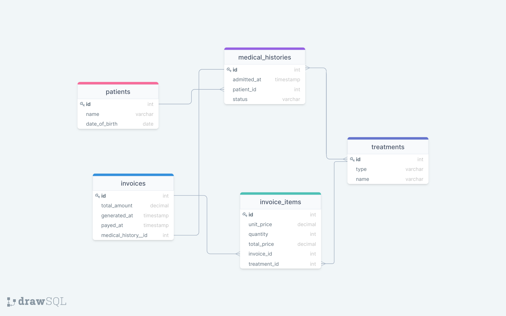

# clinic-database

A relational database to create data structures for a Clinic keeping records of patients.

## Built With

- SQL (PostgreSQL)

## Getting Started

- To get a local copy up and running follow these simple example steps.

## Author

👤 **Author**

- Github: [@AbuRayhaan](https://github.com/AbuRayhaan)
- Twitter: [@ayinla2011](https://twitter.com/Ayinla2011)
- LinkedIn: [Adisa Hammed](https://www.linkedin.com/in/hammed-adisa/)

## 🤝 Contributing

Contributions, issues, and feature requests are welcome!

Feel free to check the [issues page](../../issues/).

## Show your support

Give a ⭐️ if you like this project!

## Acknowledgments

- Hat tip to anyone whose code was used
- Inspiration
- etc

## 📝 License

This project is [MIT](./MIT.md) licensed.

